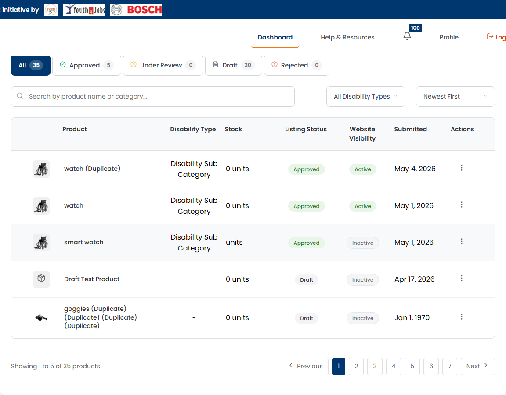

# SCRUM-111: AP Managing Product - Accessibility Bugs

---

## Bug 1: Status filter tabs missing role="tablist" ARIA pattern

**Summary:** [A11Y] All/Approved/Under Review/Draft/Rejected filter buttons missing role="tablist" and role="tab" (WCAG 4.1.2)

**Type:** Bug
**Priority:** Medium
**Severity:** Major
**Component:** Product Management - Status Filter Tabs
**Labels:** accessibility, wcag, aria-pattern, a11y-audit
**Linked Issue:** SCRUM-111
**Affects Version:** QA
**Environment:** https://hub-ui-admin-qa.swarajability.org/partner/product-management

**Description:**
The status filter buttons (All, Approved, Under Review, Draft, Rejected) function as tabs that switch the product listing content, but they don't use the ARIA tab pattern. Screen readers cannot identify them as tabs or announce the selected state.

**Steps to Reproduce:**
1. Log in as an approved Assistive Partner
2. Navigate to Product Management page
3. Inspect the status filter buttons in DevTools
4. Check for `role="tablist"`, `role="tab"`, `aria-selected`

**Expected Result:**
- Container should have `role="tablist"`
- Each button should have `role="tab"`
- Active filter should have `aria-selected="true"`
- Screen reader should announce: "All, tab, selected, 1 of 5"

**Actual Result:**
- No `role="tablist"` on container
- Buttons have no `role="tab"`
- No `aria-selected` attribute
- Screen reader announces: "All 39, button"

**WCAG Reference:** 4.1.2 Name, Role, Value (Level A)
**Impact:** Screen reader users cannot identify these as tabs or determine which filter is active.

**Screenshot:**


**Suggested Fix:**
```html
<div role="tablist" aria-label="Filter products by status">
  <button role="tab" aria-selected="true">All (39)</button>
  <button role="tab" aria-selected="false">Approved (26)</button>
  <button role="tab" aria-selected="false">Under Review (9)</button>
  <button role="tab" aria-selected="false">Draft (3)</button>
  <button role="tab" aria-selected="false">Rejected (3)</button>
</div>
```
