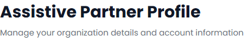

# SCRUM-155: Vendor Profile - Accessibility Bugs

---

## Bug 1: "No logo uploaded" text has critically low contrast (2.53:1)

**Summary:** [A11Y] CRITICAL - "No logo uploaded" placeholder text has contrast ratio of only 2.53:1 against white background (WCAG 1.4.3)

**Type:** Bug
**Priority:** Critical
**Severity:** Critical
**Component:** Vendor Profile - Organization Card
**Labels:** accessibility, wcag, color-contrast, a11y-audit
**Linked Issue:** SCRUM-155
**Affects Version:** QA
**Environment:** https://hub-ui-admin-qa.swarajability.org/partner/profile

**Description:**
The "No logo uploaded" placeholder text in the organization logo card has a contrast ratio of only 2.53:1 (foreground: #9ca3af, background: #ffffff, font-size: 14px). This is far below the WCAG 2.1 AA minimum of 4.5:1 — nearly half the required ratio.

**Steps to Reproduce:**
1. Log in as an Assistive Partner
2. Navigate to Profile page
3. Observe the "No logo uploaded" text in the logo card area
4. Measure contrast with axe DevTools or Colour Contrast Analyser

**Expected Result:**
Text should have a minimum contrast ratio of 4.5:1.

**Actual Result:**
Contrast ratio is 2.53:1 — fails by a wide margin.

**Screenshot:**

**WCAG Reference:** 1.4.3 Contrast (Minimum) - Level AA
**Axe Rule:** color-contrast
**Impact:** Low-vision users cannot read this text at all.

**Suggested Fix:** Darken the text color from `#9ca3af` to at least `#636b74` to achieve 4.5:1 contrast against white.

---

## Bug 2: "Verification" status label has insufficient contrast (4.44:1)

**Summary:** [A11Y] "Verification" label in account status section has contrast ratio of 4.44:1 (WCAG 1.4.3)

**Type:** Bug
**Priority:** High
**Severity:** Major
**Component:** Vendor Profile - Account Status Section
**Labels:** accessibility, wcag, color-contrast, a11y-audit
**Linked Issue:** SCRUM-155
**Affects Version:** QA
**Environment:** https://hub-ui-admin-qa.swarajability.org/partner/profile

**Description:**
The "Verification" label in the account status section has a contrast ratio of 4.44:1 (foreground: #6b7280, background: #eff6ff, font-size: 12px). This is just below the 4.5:1 minimum for normal-sized text.

**Steps to Reproduce:**
1. Log in as an Assistive Partner
2. Navigate to Profile page
3. Locate the "Verification" label in the account status area
4. Measure contrast

**Expected Result:**
Text should have a minimum contrast ratio of 4.5:1.

**Actual Result:**
Contrast ratio is 4.44:1 — fails by 0.06.

**WCAG Reference:** 1.4.3 Contrast (Minimum) - Level AA
**Axe Rule:** color-contrast

**Suggested Fix:** Darken the text color from `#6b7280` to `#656c77` or darken the background slightly.
