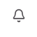
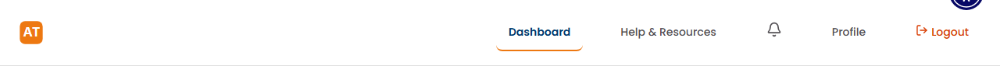
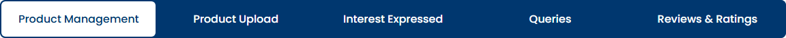
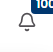

# SCRUM-18: AP Dashboard - Accessibility Bugs

---

## Bug 1: Notification bell button has no accessible name

**Summary:** [A11Y] Notification bell button is not accessible to screen readers - missing aria-label (WCAG 4.1.2)

**Type:** Bug
**Priority:** Critical
**Severity:** Critical
**Component:** AP Dashboard - Navigation
**Labels:** accessibility, wcag, screen-reader, a11y-audit
**Linked Issue:** SCRUM-18
**Affects Version:** QA
**Environment:** https://hub-ui-admin-qa.swarajability.org/partner/dashboard

**Description:**
The notification bell button in the top navigation bar has no accessible name. Screen readers announce it as just "button" with no context about its purpose. This is a WCAG 2.1 Level A violation (Success Criterion 4.1.2 - Name, Role, Value).

**Steps to Reproduce:**
1. Log in as an approved Assistive Partner
2. Navigate to the Dashboard page
3. Enable a screen reader (NVDA/JAWS/VoiceOver)
4. Tab to the notification bell button in the navigation bar
5. Listen to what the screen reader announces

**Expected Result:**
Screen reader should announce: "Notifications, 3 unread, button" (or similar descriptive text including the notification count).

**Actual Result:**
Screen reader announces only: "button" — no indication of purpose or unread count.

**Technical Details:**
```html
<!-- Current (broken) -->
<button class="nav-item notification-btn">3</button>

<!-- Expected (fixed) -->
<button class="nav-item notification-btn" aria-label="Notifications, 3 unread">3</button>
```

**WCAG Reference:** 4.1.2 Name, Role, Value (Level A)
**Axe Rule:** button-name
**Impact:** Blind and low-vision users cannot identify the purpose of this button.

**Screenshot:**


**Suggested Fix:**
Add `aria-label="Notifications, {count} unread"` to the button element. Update the label dynamically when the count changes.

---

## Bug 2: Page missing main content landmark

**Summary:** [A11Y] Dashboard page missing `<main>` landmark - screen reader users cannot jump to content (WCAG 1.3.1)

**Type:** Bug
**Priority:** High
**Severity:** Major
**Component:** AP Dashboard - Page Structure
**Labels:** accessibility, wcag, landmarks, a11y-audit
**Linked Issue:** SCRUM-18
**Affects Version:** QA
**Environment:** https://hub-ui-admin-qa.swarajability.org/partner/dashboard

**Description:**
The AP Dashboard page does not have a `<main>` element or `role="main"` landmark. Screen reader users rely on landmarks to navigate directly to the primary content area. Without it, they must tab through all navigation elements to reach the dashboard content.

**Steps to Reproduce:**
1. Log in as an approved Assistive Partner
2. Navigate to the Dashboard page
3. Enable a screen reader
4. Use landmark navigation (e.g., NVDA: D key, JAWS: Q key) to jump to main content
5. Observe that no main landmark is found

**Expected Result:**
Screen reader should find a "main" landmark and allow the user to jump directly to the dashboard content area.

**Actual Result:**
No main landmark exists. Screen reader landmark navigation does not find any main content region.

**Technical Details:**
```html
<!-- Current (broken) - no main landmark -->
<div class="dashboard-content">...</div>

<!-- Expected (fixed) -->
<main class="dashboard-content">...</main>
```

**WCAG Reference:** 1.3.1 Info and Relationships (Level A)
**Impact:** Screen reader users cannot efficiently navigate to the primary content area.

**Suggested Fix:**
Wrap the dashboard content area in a `<main>` element or add `role="main"` to the content container.

---

## Bug 3: No skip navigation link present

**Summary:** [A11Y] Dashboard page missing "Skip to main content" link (WCAG 2.4.1)

**Type:** Bug
**Priority:** High
**Severity:** Major
**Component:** AP Dashboard - Page Structure
**Labels:** accessibility, wcag, keyboard-navigation, a11y-audit
**Linked Issue:** SCRUM-18
**Affects Version:** QA
**Environment:** https://hub-ui-admin-qa.swarajability.org/partner/dashboard

**Description:**
The AP Dashboard page does not provide a "Skip to main content" link. Keyboard-only users must tab through all navigation buttons (Dashboard, Help & Resources, Profile, Logout, notification bell, and all tab links) before reaching the main content area on every page load.

**Steps to Reproduce:**
1. Log in as an approved Assistive Partner
2. Navigate to the Dashboard page
3. Press Tab key once from the top of the page
4. Observe that no "Skip to main content" or "Skip navigation" link appears

**Expected Result:**
The first focusable element on the page should be a "Skip to main content" link that, when activated, moves focus directly to the main content area.

**Actual Result:**
No skip link exists. The first Tab press focuses on the first navigation button.

**WCAG Reference:** 2.4.1 Bypass Blocks (Level A)
**Impact:** Keyboard users must repeatedly tab through 10+ navigation elements to reach content on every page visit.

**Suggested Fix:**
Add a visually hidden (but focusable) skip link as the first element in the page body:
```html
<a href="#main-content" class="skip-link">Skip to main content</a>
```
With CSS that makes it visible only on focus:
```css
.skip-link { position: absolute; top: -40px; left: 0; }
.skip-link:focus { top: 0; z-index: 9999; }
```

---

## Bug 4: Active navigation button missing aria-current="page"

**Summary:** [A11Y] Dashboard navigation button does not indicate current page state (WCAG 4.1.2)

**Type:** Bug
**Priority:** Medium
**Severity:** Major
**Component:** AP Dashboard - Navigation
**Labels:** accessibility, wcag, screen-reader, a11y-audit
**Linked Issue:** SCRUM-18
**Affects Version:** QA
**Environment:** https://hub-ui-admin-qa.swarajability.org/partner/dashboard

**Description:**
When the user is on the Dashboard page, the "Dashboard" navigation button does not have `aria-current="page"` to indicate it is the currently active page. Screen reader users cannot determine which page they are currently on from the navigation alone.

**Steps to Reproduce:**
1. Log in as an approved Assistive Partner
2. Navigate to the Dashboard page
3. Enable a screen reader
4. Tab to the "Dashboard" navigation button
5. Listen to the announcement

**Expected Result:**
Screen reader should announce: "Dashboard, current page, button" (indicating this is the active page).

**Actual Result:**
Screen reader announces: "Dashboard, button" — no indication that this is the current page.

**Technical Details:**
```html
<!-- Current (broken) -->
<button class="nav-item active">Dashboard</button>

<!-- Expected (fixed) -->
<button class="nav-item active" aria-current="page">Dashboard</button>
```

**Screenshot:**


**WCAG Reference:** 4.1.2 Name, Role, Value (Level A)
**Impact:** Screen reader users cannot determine which page is currently active from navigation context.

**Suggested Fix:**
Add `aria-current="page"` to the active navigation button. Update it dynamically when the user navigates to a different page.

---

## Bug 5: Tab navigation uses links instead of proper ARIA tab pattern

**Summary:** [A11Y] Product Management tabs missing role="tablist"/role="tab"/aria-selected pattern (WCAG 4.1.2)

**Type:** Bug
**Priority:** Medium
**Severity:** Major
**Component:** AP Dashboard - Tab Navigation
**Labels:** accessibility, wcag, aria-pattern, a11y-audit
**Linked Issue:** SCRUM-18
**Affects Version:** QA
**Environment:** https://hub-ui-admin-qa.swarajability.org/partner/dashboard

**Description:**
The horizontal tab navigation (Product Management, Product Upload, Interest Expressed, Queries, Reviews & Ratings) is implemented using `<a>` link elements without the proper ARIA tab pattern. Screen readers cannot identify these as tabs, announce tab position (e.g., "tab 1 of 5"), or communicate the selected state.

**Steps to Reproduce:**
1. Log in as an approved Assistive Partner
2. Navigate to the Dashboard page
3. Enable a screen reader
4. Navigate to the "Product Management" tab
5. Listen to the announcement
6. Check for `role="tablist"`, `role="tab"`, and `aria-selected` attributes in DevTools

**Expected Result:**
- Container should have `role="tablist"`
- Each tab should have `role="tab"`
- Active tab should have `aria-selected="true"`
- Screen reader should announce: "Product Management, tab, selected, 1 of 5"

**Actual Result:**
- No `role="tablist"` on the container
- Tabs are `<a>` links with no `role="tab"`
- No `aria-selected` attribute on any element
- Screen reader announces: "Product Management, link"

**Technical Details:**
```html
<!-- Current (broken) -->
<div class="tab-nav">
  <a href="/partner/product-management" class="active">Product Management</a>
  <a href="/partner/product-upload">Product Upload</a>
</div>

<!-- Expected (fixed) -->
<div role="tablist" aria-label="Dashboard sections">
  <a role="tab" aria-selected="true" href="/partner/product-management">Product Management</a>
  <a role="tab" aria-selected="false" href="/partner/product-upload">Product Upload</a>
</div>
```

**Screenshot:**


**WCAG Reference:** 4.1.2 Name, Role, Value (Level A)
**Impact:** Screen reader users cannot identify the navigation as tabs, cannot determine which tab is active, and cannot use standard tab keyboard patterns (arrow keys).

**Suggested Fix:**
1. Add `role="tablist"` to the tab container
2. Add `role="tab"` to each tab element
3. Add `aria-selected="true"` to the active tab and `aria-selected="false"` to inactive tabs
4. Optionally implement arrow key navigation between tabs

---

## Bug 6: Notification popup missing role="dialog" and aria-modal

**Summary:** [A11Y] Notification popup does not have dialog role - focus not trapped, not announced as modal (WCAG 4.1.2)

**Type:** Bug
**Priority:** Medium
**Severity:** Major
**Component:** AP Dashboard - Notification Centre
**Labels:** accessibility, wcag, dialog, focus-management, a11y-audit
**Linked Issue:** SCRUM-18
**Affects Version:** QA
**Environment:** https://hub-ui-admin-qa.swarajability.org/partner/dashboard

**Description:**
When the notification bell button is clicked, a popup appears showing notifications. This popup does not have `role="dialog"` or `aria-modal="true"`. As a result:
- Screen readers do not announce it as a dialog/modal
- Focus is not trapped within the popup
- Users may tab out of the popup into background content without realizing it

**Steps to Reproduce:**
1. Log in as an approved Assistive Partner
2. Navigate to the Dashboard page
3. Click the notification bell button
4. Observe the notification popup appears
5. Inspect the popup element in DevTools
6. Press Tab repeatedly to check if focus stays within the popup

**Expected Result:**
- Popup should have `role="dialog"` and `aria-modal="true"`
- Screen reader should announce: "Notifications dialog"
- Focus should be trapped within the popup
- Pressing Escape should close the popup and return focus to the bell button

**Actual Result:**
- Popup has no `role="dialog"` attribute
- Popup has no `aria-modal` attribute
- Focus is not trapped — Tab key moves focus to elements behind the popup
- Screen reader does not announce the popup as a dialog

**Technical Details:**
```html
<!-- Current (broken) -->
<div class="notification-popup">
  <h3>Notifications</h3>
  ...
</div>

<!-- Expected (fixed) -->
<div role="dialog" aria-modal="true" aria-labelledby="notif-heading" class="notification-popup">
  <h3 id="notif-heading">Notifications</h3>
  ...
</div>
```

**Screenshot:**


**WCAG Reference:** 4.1.2 Name, Role, Value (Level A), 2.1.2 No Keyboard Trap (Level A)
**Impact:** Screen reader users are not informed a dialog has opened. Keyboard users can accidentally interact with background content while the popup is open.

**Suggested Fix:**
1. Add `role="dialog"` and `aria-modal="true"` to the popup container
2. Add `aria-labelledby` pointing to the popup heading
3. Implement focus trapping within the popup
4. Return focus to the bell button when the popup is closed
5. Close the popup on Escape key press
