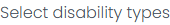
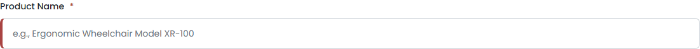
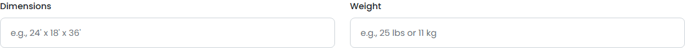

# SCRUM-19: Product Upload Form - Accessibility Bugs

---

## Bug 1: Color contrast failure on disabled dropdown placeholder text

**Summary:** [A11Y] "Select disability type first" placeholder has insufficient color contrast ratio of 3.95:1 (WCAG 1.4.3)

**Type:** Bug
**Priority:** High
**Severity:** Major
**Component:** Product Upload Form - Disability Type Dropdown
**Labels:** accessibility, wcag, color-contrast, a11y-audit
**Linked Issue:** SCRUM-19
**Affects Version:** QA
**Environment:** https://hub-ui-admin-qa.swarajability.org/partner/product-upload

**Description:**
The placeholder label "Select disability type first" in the disabled disability type dropdown has a color contrast ratio of 3.95:1, which fails the WCAG 2.1 AA minimum requirement of 4.5:1 for normal text.

**Steps to Reproduce:**
1. Log in as an approved Assistive Partner
2. Navigate to Product Upload page
3. Observe the "Select disability type first" placeholder text in the disability type dropdown
4. Measure the contrast ratio between foreground (#6c757d) and background (#e9ecef)

**Expected Result:**
Placeholder text should have a minimum contrast ratio of 4.5:1.

**Actual Result:**
Contrast ratio is 3.95:1 (foreground: #6c757d, background: #e9ecef, font-size: 16px, font-weight: normal).

**WCAG Reference:** 1.4.3 Contrast (Minimum) - Level AA
**Axe Rule:** color-contrast

**Screenshot:**


**Suggested Fix:**
Darken the placeholder text color from `#6c757d` to at least `#595f64` to achieve 4.5:1 contrast against the `#e9ecef` background.

---

## Bug 2: Seven input fields missing associated labels

**Summary:** [A11Y] 7 form input fields have no programmatic label association - screen readers cannot identify field purpose (WCAG 1.3.1)

**Type:** Bug
**Priority:** Critical
**Severity:** Critical
**Component:** Product Upload Form - Input Fields
**Labels:** accessibility, wcag, form-labels, screen-reader, a11y-audit
**Linked Issue:** SCRUM-19
**Affects Version:** QA
**Environment:** https://hub-ui-admin-qa.swarajability.org/partner/product-upload

**Description:**
Seven input fields on the Product Upload form have no programmatic label association. They rely solely on placeholder text, which disappears when the user starts typing and is not announced by all screen readers as a label. The affected fields are:

1. Product Name (`name="productName"`)
2. Dimensions (`name="dimensions"`)
3. Weight (`name="weight"`)
4. Material/Build Type (`name="materialBuildType"`)
5. Power/Battery Requirements (`name="powerBatteryRequirements"`)
6. Available Quantity (`name="availableQuantity"`)
7. Price (`name="price"`)

**Steps to Reproduce:**
1. Log in as an approved Assistive Partner
2. Navigate to Product Upload page
3. Enable a screen reader (NVDA/JAWS)
4. Tab to the Product Name field
5. Listen to the announcement — no label is read

**Expected Result:**
Each input field should have a `<label>` element with a `for` attribute matching the input's `id`, or an `aria-label`/`aria-labelledby` attribute.

**Actual Result:**
Fields have only `placeholder` attributes. No `<label>`, `aria-label`, or `aria-labelledby` is present.

**Technical Details:**
```html
<!-- Current (broken) -->
<input type="text" name="productName" placeholder="e.g., Ergonomic Wheelchair Model XR-100">

<!-- Expected (fixed) -->
<label for="productName">Product Name *</label>
<input id="productName" type="text" name="productName" placeholder="e.g., Ergonomic Wheelchair Model XR-100" aria-required="true">
```

**Screenshot:**



**WCAG Reference:** 1.3.1 Info and Relationships (Level A), 4.1.2 Name, Role, Value (Level A)
**Impact:** Blind users cannot identify what information to enter in these fields.

---

## Bug 3: Required fields missing aria-required attribute

**Summary:** [A11Y] Product Name and other mandatory fields missing required/aria-required attribute (WCAG 3.3.2)

**Type:** Bug
**Priority:** High
**Severity:** Major
**Component:** Product Upload Form - Required Fields
**Labels:** accessibility, wcag, form-validation, a11y-audit
**Linked Issue:** SCRUM-19
**Affects Version:** QA
**Environment:** https://hub-ui-admin-qa.swarajability.org/partner/product-upload

**Description:**
The Product Name field (and likely other mandatory fields) does not have a `required` or `aria-required="true"` attribute. Screen readers cannot inform users which fields are mandatory before form submission.

**Steps to Reproduce:**
1. Log in as an approved Assistive Partner
2. Navigate to Product Upload page
3. Inspect the Product Name input element in DevTools
4. Check for `required` or `aria-required` attributes

**Expected Result:**
Mandatory fields should have `required` or `aria-required="true"` so screen readers announce "required" when the field receives focus.

**Actual Result:**
No `required` or `aria-required` attribute is present on mandatory fields.

**WCAG Reference:** 3.3.2 Labels or Instructions (Level A)

**Suggested Fix:**
Add `aria-required="true"` to all mandatory form fields, or use the native HTML `required` attribute.

