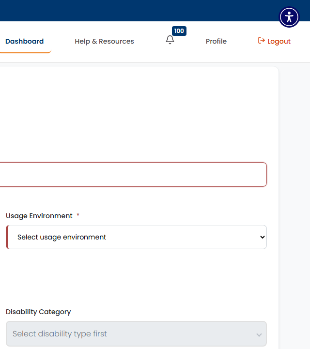

# SCRUM-20: GenAI Assistant - Accessibility Bugs

---

## Bug 1: GenAI panel missing role="dialog" when opened

**Summary:** [A11Y] GenAI Writing Assistant panel has no role="dialog" - screen readers don't announce it as a dialog (WCAG 4.1.2)

**Type:** Bug
**Priority:** High
**Severity:** Major
**Component:** GenAI Assistant - Panel Structure
**Labels:** accessibility, wcag, dialog, aria-pattern, a11y-audit
**Linked Issue:** SCRUM-20
**Affects Version:** QA
**Environment:** https://hub-ui-admin-qa.swarajability.org/partner/product-upload

**Description:**
When the "Assist with GenAI" button is clicked and the GenAI Writing Assistant panel opens, it does not have `role="dialog"` or `aria-modal="true"`. Screen readers do not announce the panel as a dialog, and focus is not properly managed.

**Steps to Reproduce:**
1. Log in as an approved Assistive Partner
2. Navigate to Product Upload page
3. Click the "Assist with GenAI" button (next to Short Description)
4. Enable screen reader and observe the announcement
5. Inspect the panel element in DevTools for role attribute

**Expected Result:**
- Panel should have `role="dialog"` and `aria-modal="true"`
- Screen reader should announce: "GenAI Writing Assistant, dialog"
- Focus should move into the dialog
- Focus should be trapped within the dialog

**Actual Result:**
- Panel has no `role="dialog"` attribute
- Screen reader does not announce it as a dialog
- Focus management is not implemented

**Screenshot:**


**WCAG Reference:** 4.1.2 Name, Role, Value (Level A)

**Suggested Fix:**
Add `role="dialog"` and `aria-modal="true"` to the GenAI panel container. Add `aria-labelledby` pointing to the panel heading. Implement focus trapping.

---

## Bug 2: No aria-live regions for GenAI loading/status announcements

**Summary:** [A11Y] GenAI content generation has no aria-live region - screen readers don't announce loading or completion status (WCAG 4.1.3)

**Type:** Bug
**Priority:** High
**Severity:** Major
**Component:** GenAI Assistant - Status Messages
**Labels:** accessibility, wcag, aria-live, status-messages, a11y-audit
**Linked Issue:** SCRUM-20
**Affects Version:** QA
**Environment:** https://hub-ui-admin-qa.swarajability.org/partner/product-upload

**Description:**
When GenAI content is being generated, there are no `aria-live` regions on the page to announce the loading state or completion to screen reader users. Users who cannot see the visual loading indicator have no way to know content is being generated or when it's ready.

**Steps to Reproduce:**
1. Log in as an approved Assistive Partner
2. Navigate to Product Upload page
3. Open GenAI panel and trigger content generation
4. Enable screen reader and listen for loading/completion announcements
5. Inspect page for `[aria-live]` attributes

**Expected Result:**
- A region with `aria-live="polite"` should announce "Generating content, please wait..."
- On completion, it should announce "Content generated successfully"

**Actual Result:**
No `aria-live` regions exist anywhere on the Product Upload page. Screen reader users receive no feedback about generation status.

**WCAG Reference:** 4.1.3 Status Messages (Level AA)

**Suggested Fix:**
Add an `aria-live="polite"` region that updates with status text during content generation:
```html
<div aria-live="polite" aria-atomic="true" class="sr-only">
  <!-- Dynamically updated: "Generating content..." → "Content generated successfully" -->
</div>
```

---

## Bug 3: AI disclaimer text not present or not accessible in GenAI panel

**Summary:** [A11Y] GenAI panel missing AI-generated content disclaimer - users not informed content is AI-generated (WCAG 4.1.2)

**Type:** Bug
**Priority:** Medium
**Severity:** Major
**Component:** GenAI Assistant - Disclaimer
**Labels:** accessibility, wcag, ai-transparency, a11y-audit
**Linked Issue:** SCRUM-20
**Affects Version:** QA
**Environment:** https://hub-ui-admin-qa.swarajability.org/partner/product-upload

**Description:**
The GenAI Writing Assistant panel does not display a visible disclaimer informing users that the content is AI-generated and should be reviewed before publishing. This is both an accessibility and transparency issue.

**Steps to Reproduce:**
1. Log in as an approved Assistive Partner
2. Navigate to Product Upload page
3. Click "Assist with GenAI" button
4. Search for any text containing "AI-generated", "review", or "generated by AI"

**Expected Result:**
A visible disclaimer should state: "AI-generated content must be reviewed by the vendor before publishing" or similar text.

**Actual Result:**
No disclaimer text found in the GenAI panel.

**WCAG Reference:** 4.1.2 Name, Role, Value (Level A) - users must be informed about the nature of content

**Suggested Fix:**
Add a disclaimer with `role="note"` or within an `<aside>` element:
```html
<aside role="note" aria-label="AI Disclaimer">
  <p>This content is AI-generated and should be reviewed for accuracy before publishing.</p>
</aside>
```
