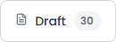
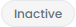

# SCRUM-21: Product Preview/Management - Accessibility Bugs

---

## Bug 1: Color contrast failures on Product Management page (4 elements)

**Summary:** [A11Y] Multiple elements on Product Management page have insufficient color contrast ratio (WCAG 1.4.3)

**Type:** Bug
**Priority:** High
**Severity:** Major
**Component:** Product Management - Table/Filters
**Labels:** accessibility, wcag, color-contrast, a11y-audit
**Linked Issue:** SCRUM-21
**Affects Version:** QA
**Environment:** https://hub-ui-admin-qa.swarajability.org/partner/product-management

**Description:**
Four elements on the Product Management page fail the WCAG 2.1 AA minimum color contrast ratio of 4.5:1:

1. **Filter tab count badge** (`.count` span): Contrast ratio 4.39:1
   - Foreground: #6b7280, Background: #f3f4f6, Font: 12px normal
   
2. **"Inactive" website status badges** (3 instances): Contrast ratio 4.43:1
   - Foreground: #6b7280, Background: #f5f5f5, Font: 12px normal

**Steps to Reproduce:**
1. Log in as an approved Assistive Partner
2. Navigate to Product Management page
3. Observe the count badges on filter tabs (e.g., "30" on Draft tab)
4. Observe the "Inactive" status text in the Website Visibility column
5. Measure contrast with a tool like axe DevTools or Colour Contrast Analyser

**Expected Result:**
All text elements should have a minimum contrast ratio of 4.5:1 for normal-sized text (below 18pt/14pt bold).

**Actual Result:**
- Count badge: 4.39:1 (needs 4.5:1) — fails by 0.11
- Inactive status: 4.43:1 (needs 4.5:1) — fails by 0.07

**WCAG Reference:** 1.4.3 Contrast (Minimum) - Level AA
**Axe Rule:** color-contrast

**Screenshot:**

**Suggested Fix:**
Darken the text color from `#6b7280` to `#5f6672` (or darker) to achieve 4.5:1 contrast against both `#f3f4f6` and `#f5f5f5` backgrounds.

