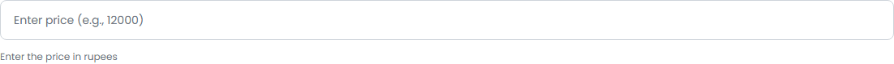
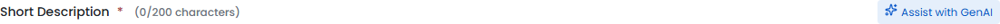

# SCRUM-22: Edit Product with GenAI - Accessibility Bugs

---

## Bug 1: 10 form input fields missing programmatic labels

**Summary:** [A11Y] CRITICAL - 10 form inputs have no label, aria-label, or aria-labelledby - screen readers cannot identify fields (WCAG 1.3.1, 4.1.2)

**Type:** Bug
**Priority:** Critical
**Severity:** Critical
**Component:** Product Upload/Edit Form - All Input Fields
**Labels:** accessibility, wcag, form-labels, screen-reader, a11y-audit
**Linked Issue:** SCRUM-22
**Affects Version:** QA
**Environment:** https://hub-ui-admin-qa.swarajability.org/partner/product-upload

**Description:**
10 input fields on the Product Upload/Edit form have no programmatic label association. They rely solely on placeholder text. Affected fields:

1. Product Name (`name="productName"`)
2. Dimensions (`name="dimensions"`)
3. Weight (`name="weight"`)
4. Material/Build Type (`name="materialBuildType"`)
5. Power/Battery Requirements (`name="powerBatteryRequirements"`)
6. Available Quantity (`name="availableQuantity"`)
7. Price (`name="price"`)
8. Support Helpline Number (`name="supportHelplineNumber"`)
9. Expected Delivery Time (`name="expectedDeliveryTime"`)
10. Tags/Metadata (`name="tagsMetadata"`)

**WCAG Reference:** 1.3.1 Info and Relationships (Level A), 4.1.2 Name, Role, Value (Level A)
**Impact:** Blind users cannot identify what information to enter in any of these fields.

**Screenshot:**

**Suggested Fix:** Add `<label for="fieldId">` elements or `aria-label` attributes to all inputs.

---

## Bug 2: GenAI button tooltip missing role="tooltip"

**Summary:** [A11Y] GenAI "Assist with GenAI" button tooltip has no role="tooltip" - not announced by screen readers (WCAG 4.1.2)

**Type:** Bug
**Priority:** Medium
**Severity:** Major
**Component:** Product Upload/Edit Form - GenAI Buttons
**Labels:** accessibility, wcag, tooltip, aria-pattern, a11y-audit
**Linked Issue:** SCRUM-22
**Affects Version:** QA
**Environment:** https://hub-ui-admin-qa.swarajability.org/partner/product-upload

**Description:**
When hovering over the "Assist with GenAI" button, a tooltip appears but it does not have `role="tooltip"`. Screen readers cannot identify it as supplementary information and may not announce it.

**WCAG Reference:** 4.1.2 Name, Role, Value (Level A)

**Screenshot:**

**Suggested Fix:** Add `role="tooltip"` to the tooltip element and `aria-describedby` on the button pointing to the tooltip's ID.
