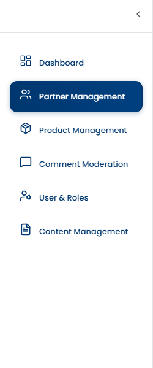
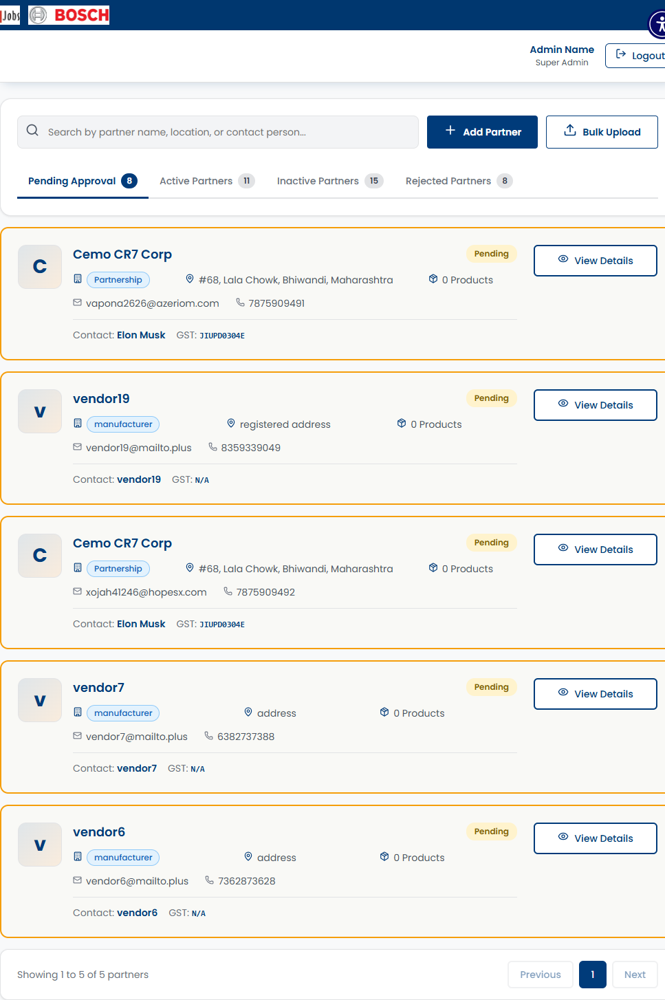

# SCRUM-466: Admin Partner Management Dashboard - Accessibility Bugs

---

## Bug 1: Toggle button has no accessible name (Critical)

**Summary:** [A11Y] CRITICAL - Admin Dashboard toggle button has no discernible text - screen readers announce only "button" (WCAG 4.1.2)

**Type:** Bug
**Priority:** Critical
**Severity:** Critical
**Component:** Admin Dashboard - Navigation/Toggle
**Labels:** accessibility, wcag, button-name, screen-reader, a11y-audit
**Linked Issue:** SCRUM-466
**Affects Version:** QA
**Environment:** https://hub-ui-admin-qa.swarajability.org/admin/dashboard

**Description:**
A toggle button (`<button class="toggle-btn">`) on the Admin Dashboard has no accessible name. It has no inner text, no `aria-label`, no `title`, and no associated label. Screen readers announce it as just "button" with no context about its purpose.

**Steps to Reproduce:**
1. Log in as Admin (pv@mailto.plus)
2. Navigate to Admin Dashboard
3. Inspect the toggle button element in DevTools
4. Enable screen reader and Tab to the button

**Expected Result:**
Button should have a descriptive accessible name (e.g., "Toggle sidebar", "Menu", or similar).

**Actual Result:**
```html
<button class="toggle-btn"></button>
```
No text, no aria-label, no title. Screen reader announces: "button".

**WCAG Reference:** 4.1.2 Name, Role, Value (Level A)
**Axe Rule:** button-name
**Impact:** Screen reader users cannot identify the purpose of this button.

**Screenshot:**


**Suggested Fix:**
```html
<button class="toggle-btn" aria-label="Toggle sidebar navigation">
  <!-- icon -->
</button>
```

---

## Bug 2: No `<main>` landmark on Admin Dashboard

**Summary:** [A11Y] Admin Dashboard missing `<main>` landmark (WCAG 1.3.1)

**Type:** Bug
**Priority:** High
**Severity:** Major
**Component:** Admin Dashboard - Page Structure
**Labels:** accessibility, wcag, landmarks, a11y-audit
**Linked Issue:** SCRUM-466
**Affects Version:** QA
**Environment:** https://hub-ui-admin-qa.swarajability.org/admin/dashboard

**Description:**
The Admin Dashboard page does not have a `<main>` element or `role="main"` landmark. Screen reader users cannot jump directly to the main content area.

**WCAG Reference:** 1.3.1 Info and Relationships (Level A)

**Screenshot:**


**Suggested Fix:** Wrap the dashboard content area in `<main>`.

---

## Bug 3: No aria-live regions for dynamic metric updates

**Summary:** [A11Y] Admin Dashboard has no aria-live regions - metric updates not announced to screen readers (WCAG 4.1.3)

**Type:** Bug
**Priority:** High
**Severity:** Major
**Component:** Admin Dashboard - Metric Widgets
**Labels:** accessibility, wcag, aria-live, status-messages, a11y-audit
**Linked Issue:** SCRUM-466
**Affects Version:** QA
**Environment:** https://hub-ui-admin-qa.swarajability.org/admin/dashboard

**Description:**
The Admin Dashboard displays dynamic metrics (Pending Approvals, Active Partners, Total Products, Average Approval Time) that update in real-time or on page reload. However, there are no `aria-live` regions on the page. When metric values change, screen reader users receive no notification.

**Steps to Reproduce:**
1. Log in as Admin
2. Navigate to Admin Dashboard
3. Search DOM for `[aria-live]` — zero results
4. Reload page — metrics update silently

**Expected Result:**
Metric widget area should have `aria-live="polite"` so screen readers announce when values change.

**Actual Result:**
No `aria-live` attributes anywhere on the page. Updates are silent to screen readers.

**WCAG Reference:** 4.1.3 Status Messages (Level AA)

**Screenshot:**


**Suggested Fix:**
```html
<div aria-live="polite" aria-atomic="true">
  <!-- Metric widgets here -->
</div>
```
