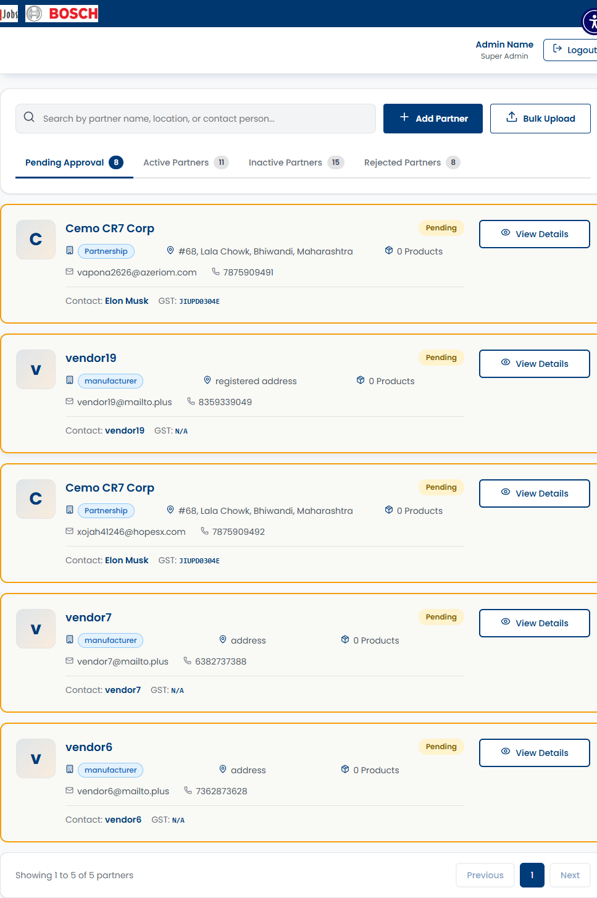
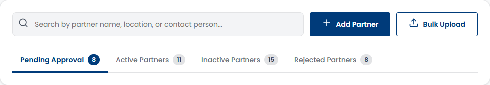
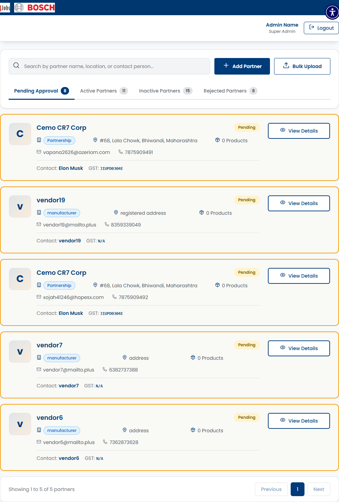

# SCRUM-469: Admin View Vendor Lists by Status - Accessibility Bugs

---

## Bug 1: Status tabs missing ARIA tablist pattern (Critical)

**Summary:** [A11Y] CRITICAL - Vendor Lists status tabs have no role="tablist"/role="tab" - screen readers cannot identify tab navigation (WCAG 4.1.2)

**Type:** Bug
**Priority:** Critical
**Severity:** Critical
**Component:** Admin - Partner Management / Vendor Lists
**Labels:** accessibility, wcag, aria-tabs, tablist, screen-reader, a11y-audit
**Linked Issue:** SCRUM-469
**Affects Version:** QA
**Environment:** https://hub-ui-admin-qa.swarajability.org/admin/partners

**Description:**
The status filter tabs (Pending, Active, Inactive, Rejected) on the Vendor Lists page do not implement the ARIA tabs pattern. The container has no `role="tablist"`, individual tabs have no `role="tab"`, there is no `aria-selected` attribute, and no `role="tabpanel"` for the content area. Screen readers cannot identify these as tabs or announce the selected state.

**Steps to Reproduce:**
1. Log in as Admin (pv@mailto.plus)
2. Navigate to Partner Management → Vendor Lists
3. Inspect the status filter tabs (Pending, Active, Inactive, Rejected)
4. Check for role="tablist" on container — NOT FOUND
5. Check for role="tab" on individual tabs — NOT FOUND
6. Check for aria-selected on active tab — NOT FOUND

**Expected Result:**
```html
<div role="tablist" aria-label="Filter vendors by status">
  <button role="tab" aria-selected="true" aria-controls="panel-pending">Pending (5)</button>
  <button role="tab" aria-selected="false" aria-controls="panel-active">Active (12)</button>
  ...
</div>
<div role="tabpanel" id="panel-pending">...</div>
```

**Actual Result:**
Plain `<button>` elements with no ARIA roles or states. Screen readers announce them as generic buttons, not tabs.

**WCAG Reference:** 4.1.2 Name, Role, Value (Level A)
**Impact:** Screen reader users cannot identify the tab navigation pattern or know which tab is currently selected.

**Screenshot:**


**Suggested Fix:**
Add `role="tablist"` to container, `role="tab"` + `aria-selected` to each tab, and `role="tabpanel"` to content area.

---

## Bug 2: Vendor cards have no semantic structure (Major)

**Summary:** [A11Y] Vendor cards use generic `<div>` with no semantic role - screen readers cannot identify card boundaries (WCAG 1.3.1)

**Type:** Bug
**Priority:** High
**Severity:** Major
**Component:** Admin - Partner Management / Vendor Cards
**Labels:** accessibility, wcag, semantics, landmarks, a11y-audit
**Linked Issue:** SCRUM-469
**Affects Version:** QA
**Environment:** https://hub-ui-admin-qa.swarajability.org/admin/partners

**Description:**
Vendor cards on the Partner Management page are rendered as plain `<div>` elements with no semantic role (`article`, `section`, or `aria-label`). Screen reader users cannot identify where one vendor card ends and another begins, making it difficult to navigate the list.

**Steps to Reproduce:**
1. Log in as Admin
2. Navigate to Partner Management → Vendor Lists
3. Inspect a vendor card element in DevTools
4. Verify tag is `<div>` with no `role` attribute and no `aria-label`

**Expected Result:**
Each vendor card should be an `<article>` or have `role="article"` with an `aria-label` describing the vendor.

**Actual Result:**
```html
<div class="card"><!-- vendor content --></div>
```
No semantic role, no aria-label. Screen readers cannot distinguish card boundaries.

**WCAG Reference:** 1.3.1 Info and Relationships (Level A)
**Impact:** Screen reader users cannot navigate between vendor cards or understand the card structure.

**Screenshot:**


**Suggested Fix:**
```html
<article class="card" aria-label="Vendor: ABC Corp - Active">
  <!-- vendor card content -->
</article>
```

---

## Bug 4: Vendor list has no semantic list structure (Major)

**Summary:** [A11Y] Vendor list does not use `<ul>`/`<ol>` or role="list" - screen readers cannot announce item count (WCAG 1.3.1)

**Type:** Bug
**Priority:** High
**Severity:** Major
**Component:** Admin - Partner Management / Vendor Lists
**Labels:** accessibility, wcag, semantics, list-structure, a11y-audit
**Linked Issue:** SCRUM-469
**Affects Version:** QA
**Environment:** https://hub-ui-admin-qa.swarajability.org/admin/partners

**Description:**
The vendor list container uses a custom Angular component (`<app-admin-partners>`) with `<div>` children instead of semantic list elements (`<ul>`, `<ol>`, or `role="list"`). Screen readers cannot announce "list, 5 items" which helps users understand the page structure and navigate efficiently.

**Steps to Reproduce:**
1. Log in as Admin
2. Navigate to Partner Management → Vendor Lists
3. Inspect the vendor list container in DevTools
4. Verify no `<ul>`, `<ol>`, or `role="list"` exists for the vendor cards

**Expected Result:**
```html
<ul role="list" aria-label="Vendor list">
  <li role="listitem"><!-- vendor card --></li>
  <li role="listitem"><!-- vendor card --></li>
</ul>
```
Screen reader announces: "list, 5 items"

**Actual Result:**
```html
<app-admin-partners>
  <div class="card">...</div>
  <div class="card">...</div>
</app-admin-partners>
```
No list semantics. Screen reader cannot announce item count.

**WCAG Reference:** 1.3.1 Info and Relationships (Level A)
**Impact:** Screen reader users cannot determine how many vendors are in the list or navigate by list items.

**Screenshot:**


**Suggested Fix:**
Wrap vendor cards in `<ul role="list">` with each card as `<li role="listitem">`.
