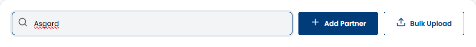
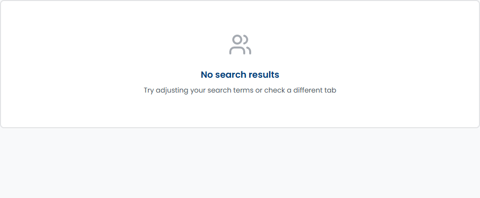

# SCRUM-472: Admin Search Vendors - Accessibility Bugs

---

## Bug 1: No aria-live region for search results announcements (Critical)

**Summary:** [A11Y] CRITICAL - Search results update silently with no aria-live region - screen readers cannot announce result count (WCAG 4.1.3)

**Type:** Bug
**Priority:** Critical
**Severity:** Critical
**Component:** Admin - Partner Management / Search
**Labels:** accessibility, wcag, aria-live, status-messages, search, a11y-audit
**Linked Issue:** SCRUM-472
**Affects Version:** QA
**Environment:** https://hub-ui-admin-qa.swarajability.org/admin/partners

**Description:**
When an admin types a search query in the vendor search field, results update dynamically on the page. However, there is no `aria-live` region anywhere on the page. Screen reader users receive no announcement when results change — they have no way to know how many vendors matched their search without manually navigating away from the search input.

**Steps to Reproduce:**
1. Log in as Admin (pv@mailto.plus)
2. Navigate to Partner Management
3. Type "Asgard" in the search field
4. Results update on screen — but no `aria-live` region exists
5. Inspect DOM for `[aria-live]` — zero results

**Expected Result:**
```html
<div aria-live="polite" aria-atomic="true">
  5 vendors found matching "Asgard"
</div>
```
Screen reader announces: "5 vendors found matching Asgard"

**Actual Result:**
No `aria-live` attribute anywhere on the page. Results update silently. Screen reader users must Tab away from search to discover results.

**WCAG Reference:** 4.1.3 Status Messages (Level AA)
**Impact:** Screen reader users cannot know if their search returned results without leaving the search field.

**Screenshot:**


**Suggested Fix:**
Add `aria-live="polite"` region that announces result count: "X vendors found" or "No vendors found".

---

## Bug 2: No-results message has no accessible role (Major)

**Summary:** [A11Y] "No search results" message has no role="status" or aria-live - not announced to screen readers (WCAG 4.1.3)

**Type:** Bug
**Priority:** High
**Severity:** Major
**Component:** Admin - Partner Management / Search
**Labels:** accessibility, wcag, status-messages, no-results, a11y-audit
**Linked Issue:** SCRUM-472
**Affects Version:** QA
**Environment:** https://hub-ui-admin-qa.swarajability.org/admin/partners

**Description:**
When a search query returns no matching vendors, a "No search results" heading is displayed. However, this message has no `role="status"`, no `role="alert"`, and no parent `aria-live` region. Screen reader users typing in the search field will not be notified that their search returned no results.

**Steps to Reproduce:**
1. Log in as Admin
2. Navigate to Partner Management
3. Type "xyznonexistent123" in search field
4. "No search results" heading appears visually
5. Inspect element — no `role` attribute, no `aria-live` on parent

**Expected Result:**
```html
<div role="status" aria-live="polite">
  <h3>No search results</h3>
  <p>Try different keywords or check spelling</p>
</div>
```

**Actual Result:**
```html
<h3>No search results</h3>
```
No role, no aria-live. Screen reader users are not notified.

**WCAG Reference:** 4.1.3 Status Messages (Level AA)
**Impact:** Screen reader users cannot know their search returned no results without manually navigating.

**Screenshot:**


**Suggested Fix:**
Wrap the no-results message in a container with `role="status"` or `aria-live="polite"`.
