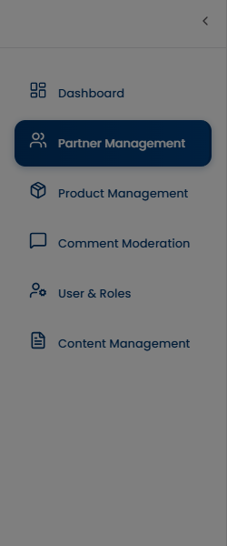
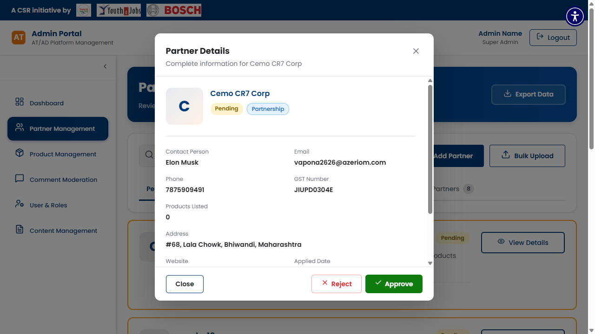

# SCRUM-475: Admin View Vendor Details - Accessibility Bugs

---

## Bug 1: Vendor Details panel has no role="dialog" (Critical)

**Summary:** [A11Y] CRITICAL - Vendor Details panel has no role="dialog" or aria-modal - screen readers cannot identify it as a dialog (WCAG 4.1.2)

**Type:** Bug
**Priority:** Critical
**Severity:** Critical
**Component:** Admin - Partner Management / Vendor Details Panel
**Labels:** accessibility, wcag, dialog-role, aria-modal, screen-reader, a11y-audit
**Linked Issue:** SCRUM-475
**Affects Version:** QA
**Environment:** https://hub-ui-admin-qa.swarajability.org/admin/partners

**Description:**
When an admin clicks "View Details" on a vendor card, a detail panel/modal opens. However, this panel has no `role="dialog"`, no `aria-modal="true"`, and no `aria-label` or `aria-labelledby`. Screen readers cannot identify it as a dialog, cannot announce it on open, and cannot properly scope navigation within it.

**Steps to Reproduce:**
1. Log in as Admin (pv@mailto.plus)
2. Navigate to Partner Management
3. Click "View Details" on any vendor card
4. Inspect the opened panel in DevTools
5. Check for `role="dialog"` — NOT FOUND
6. Check for `aria-modal="true"` — NOT FOUND

**Expected Result:**
```html
<div role="dialog" aria-modal="true" aria-labelledby="vendor-detail-heading">
  <h2 id="vendor-detail-heading">Vendor Details: [Name]</h2>
  <!-- content -->
</div>
```

**Actual Result:**
Panel opens as a generic `<div>` with no dialog role. Screen readers do not announce it as a dialog.

**WCAG Reference:** 4.1.2 Name, Role, Value (Level A)
**Impact:** Screen reader users cannot identify the panel as a dialog or understand its purpose.

**Screenshot:**


**Suggested Fix:**
Add `role="dialog"`, `aria-modal="true"`, and `aria-labelledby` pointing to the panel heading.

---

## Bug 2: Focus does not move into detail panel on open (Critical)

**Summary:** [A11Y] CRITICAL - Focus does not move into Vendor Details panel when opened - keyboard users stranded (WCAG 2.4.3)

**Type:** Bug
**Priority:** Critical
**Severity:** Critical
**Component:** Admin - Partner Management / Vendor Details Panel
**Labels:** accessibility, wcag, focus-management, keyboard, a11y-audit
**Linked Issue:** SCRUM-475
**Affects Version:** QA
**Environment:** https://hub-ui-admin-qa.swarajability.org/admin/partners

**Description:**
When the Vendor Details panel opens, focus remains on the background page instead of moving into the panel. Keyboard-only users cannot interact with the panel content without manually tabbing through the entire page. This also means the panel has no focus trap — Tab key moves focus to background elements.

**Steps to Reproduce:**
1. Log in as Admin
2. Navigate to Partner Management
3. Click "View Details" on a vendor card
4. Panel opens — but focus stays on the background
5. Press Tab — focus moves to background elements, not panel content

**Expected Result:**
Focus should move to the panel heading or first interactive element (close button) immediately on open. Tab should cycle within the panel only.

**Actual Result:**
Focus remains on background. Tab navigates background elements. Panel content unreachable without mouse.

**WCAG Reference:** 2.4.3 Focus Order (Level A), 2.1.2 No Keyboard Trap (Level A)
**Impact:** Keyboard-only users cannot access the vendor details panel content.

**Screenshot:**


**Suggested Fix:**
1. On panel open: `panelElement.focus()` or focus the heading/close button
2. Add focus trap: Tab should cycle within the panel
3. On close: return focus to the "View Details" button that triggered it
