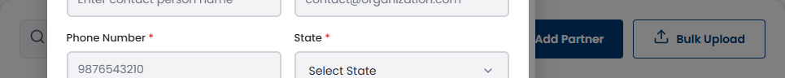
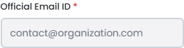
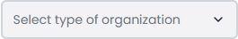
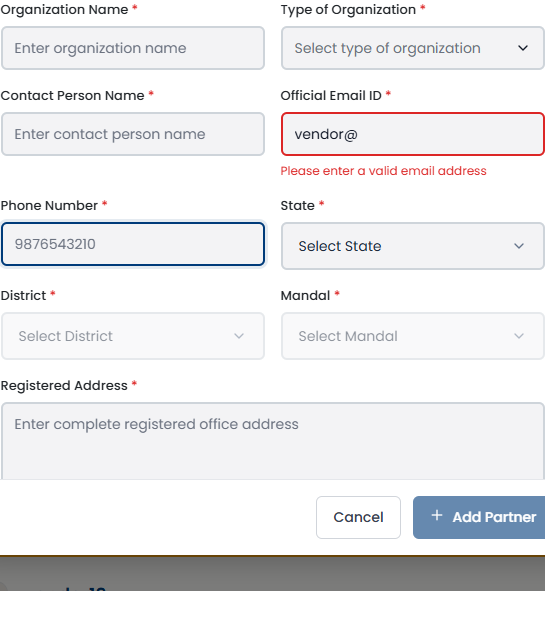

# SCRUM-487: Admin Add Vendor Manually - Accessibility Bugs

---

## Bug 1: Mandatory form fields missing required/aria-required attribute (Major)

**Summary:** [A11Y] Add Vendor form fields have no required or aria-required attribute - screen readers cannot announce mandatory fields (WCAG 3.3.2)

**Type:** Bug
**Priority:** High
**Severity:** Major
**Component:** Admin - Add Vendor Modal / Form Fields
**Labels:** accessibility, wcag, form-validation, required-fields, a11y-audit
**Linked Issue:** SCRUM-487
**Affects Version:** QA
**Environment:** https://hub-ui-admin-qa.swarajability.org/admin/partners

**Description:**
The Add Vendor form has mandatory fields (Vendor Name, Email, Phone, etc.) but none of them have `required` or `aria-required="true"` attributes. Screen reader users cannot determine which fields are mandatory before submitting the form.

**Steps to Reproduce:**
1. Log in as Admin (pv@mailto.plus)
2. Navigate to Partner Management
3. Click "Add Vendor" button
4. Inspect any form input in DevTools
5. Check for `required` or `aria-required` attributes — NONE FOUND

**Expected Result:**
```html
<input name="vendorName" required aria-required="true" />
```
Screen reader announces: "Vendor Name, required, edit"

**Actual Result:**
No `required` or `aria-required` on any field. Screen readers do not announce which fields are mandatory.

**WCAG Reference:** 3.3.2 Labels or Instructions (Level A)
**Impact:** Screen reader users cannot identify mandatory fields, leading to repeated form submission failures.

**Screenshot:**


**Suggested Fix:**
Add `aria-required="true"` to all mandatory fields, or use the native `required` attribute.

---

## Bug 2: Email field missing autocomplete="email" attribute (Minor)

**Summary:** [A11Y] Add Vendor email field missing autocomplete="email" - browsers cannot auto-fill (WCAG 1.3.5)

**Type:** Bug
**Priority:** Medium
**Severity:** Minor
**Component:** Admin - Add Vendor Modal / Email Field
**Labels:** accessibility, wcag, autocomplete, input-purpose, a11y-audit
**Linked Issue:** SCRUM-487
**Affects Version:** QA
**Environment:** https://hub-ui-admin-qa.swarajability.org/admin/partners

**Description:**
The Contact Email field in the Add Vendor form does not have `autocomplete="email"`. Users with cognitive disabilities or motor impairments who rely on browser autofill cannot benefit from automatic field population.

**Steps to Reproduce:**
1. Log in as Admin
2. Navigate to Partner Management → Add Vendor
3. Inspect the email input field
4. Check for `autocomplete` attribute — NOT FOUND

**Expected Result:**
```html
<input type="email" name="email" autocomplete="email" />
```

**Actual Result:**
No `autocomplete` attribute on email field.

**WCAG Reference:** 1.3.5 Identify Input Purpose (Level AA)
**Impact:** Users who rely on autofill cannot automatically populate the email field.

**Screenshot:**


**Suggested Fix:**
Add `autocomplete="email"` to the email field. Also add `autocomplete="tel"` to phone and `autocomplete="url"` to website fields.

---

## Bug 3: "Select type of organization" placeholder has insufficient contrast (Major)

**Summary:** [A11Y] Add Vendor dropdown placeholder "Select type of organization" has insufficient color contrast (WCAG 1.4.3)

**Type:** Bug
**Priority:** High
**Severity:** Major
**Component:** Admin - Add Vendor Modal / Business Type Dropdown
**Labels:** accessibility, wcag, color-contrast, placeholder, a11y-audit
**Linked Issue:** SCRUM-487
**Affects Version:** QA
**Environment:** https://hub-ui-admin-qa.swarajability.org/admin/partners

**Description:**
The "Select type of organization" placeholder text in the Business Type dropdown has insufficient color contrast, failing the WCAG 2.1 AA minimum of 4.5:1 for normal text. The text uses a light gray color against a white/light background.

**Steps to Reproduce:**
1. Log in as Admin
2. Navigate to Partner Management → Add Vendor
3. Observe the "Select type of organization" placeholder in the dropdown
4. Measure contrast with axe DevTools — FAILS

**Expected Result:**
Placeholder text should have a minimum contrast ratio of 4.5:1.

**Actual Result:**
Placeholder text fails contrast check (light gray on white/light background).

**WCAG Reference:** 1.4.3 Contrast (Minimum) - Level AA
**Axe Rule:** color-contrast
**Impact:** Low-vision users cannot read the placeholder text.

**Screenshot:**


**Suggested Fix:**
Darken the placeholder text color to achieve 4.5:1 contrast ratio.


---

## Bug 4: Validation error messages not linked to fields via aria-describedby (Major)

**Summary:** [A11Y] Form validation errors not programmatically linked to input fields - screen readers cannot associate errors with fields (WCAG 3.3.1)

**Type:** Bug
**Priority:** High
**Severity:** Major
**Component:** Admin - Add Vendor Modal / Form Validation
**Labels:** accessibility, wcag, form-validation, error-messages, a11y-audit
**Linked Issue:** SCRUM-487
**Affects Version:** QA
**Environment:** https://hub-ui-admin-qa.swarajability.org/admin/partners

**Description:**
When an invalid email is entered in the Add Vendor form and validation triggers, an inline error message appears visually. However, the error message is NOT linked to the input field via `aria-describedby`. Screen reader users who Tab to the email field will not hear the error message — they must visually scan the page to find it.

**Steps to Reproduce:**
1. Log in as Admin (pv@mailto.plus)
2. Navigate to Partner Management → Add Vendor
3. Enter invalid email "vendor@" in the email field
4. Tab out of the field (triggers validation)
5. Error message appears visually
6. Inspect the email input — check for `aria-describedby` — NOT FOUND
7. Inspect the error message — check for matching `id` — NOT FOUND

**Expected Result:**
```html
<input type="email" aria-describedby="email-error" aria-invalid="true" />
<span id="email-error" role="alert">Please enter a valid email address</span>
```
Screen reader announces: "Email, invalid entry, Please enter a valid email address"

**Actual Result:**
Error message is visually present but not programmatically linked to the field. Screen reader users cannot discover the error when focused on the field.

**WCAG Reference:** 3.3.1 Error Identification (Level A)
**Impact:** Screen reader users cannot identify which field has an error or what the error is.

**Screenshot:**


**Suggested Fix:**
1. Add `id` to error message element
2. Add `aria-describedby="error-id"` to the input field
3. Add `aria-invalid="true"` to the input when invalid
4. Optionally add `role="alert"` to the error for immediate announcement
