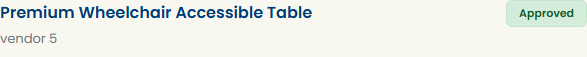

# SCRUM-499: Admin Review & Approve Product Edit Requests - Accessibility Bugs

---

## Bug 1: Product card vendor name and metadata labels have insufficient contrast (Major)

**Summary:** [A11Y] Vendor name and metadata labels (Price, Category) on product cards have insufficient contrast (#6c757d on white) (WCAG 1.4.3)

**Type:** Bug
**Priority:** High
**Severity:** Major
**Component:** Admin - Product Management / Product Cards (Pending Edits tab)
**Labels:** accessibility, wcag, color-contrast, a11y-audit
**Linked Issue:** SCRUM-499
**Affects Version:** QA
**Environment:** https://hub-ui-admin-qa.swarajability.org/admin/products

**Description:**
On the Admin Product Management Dashboard (Pending Edits tab), the vendor name (`
`) and metadata labels (`Price:`, `Category:`) use color `#6c757d` (rgb(108, 117, 125)) on a white/light background. This fails the WCAG 2.1 AA minimum contrast ratio of 4.5:1 for normal text.

**Steps to Reproduce:**
1. Log in as Admin (pv@mailto.plus)
2. Navigate to Product Management (admin/products)
3. Click "Pending Edits" tab
4. Inspect vendor name or "Price:" / "Category:" labels
5. Measure contrast: foreground #6c757d on white background

**Expected Result:**
All text should have minimum 4.5:1 contrast ratio.

**Actual Result:**
- Vendor name: `color: rgb(108, 117, 125)` = #6c757d — approximately 4.0:1 on white (FAILS)
- Meta labels (Price, Category): same color — FAILS

**WCAG Reference:** 1.4.3 Contrast (Minimum) - Level AA
**Axe Rule:** color-contrast
**Impact:** Low-vision users cannot easily read vendor names and metadata labels.

**Screenshot:**

**Suggested Fix:**
Darken text color from `#6c757d` to at least `#595f64` to achieve 4.5:1 contrast against white.
